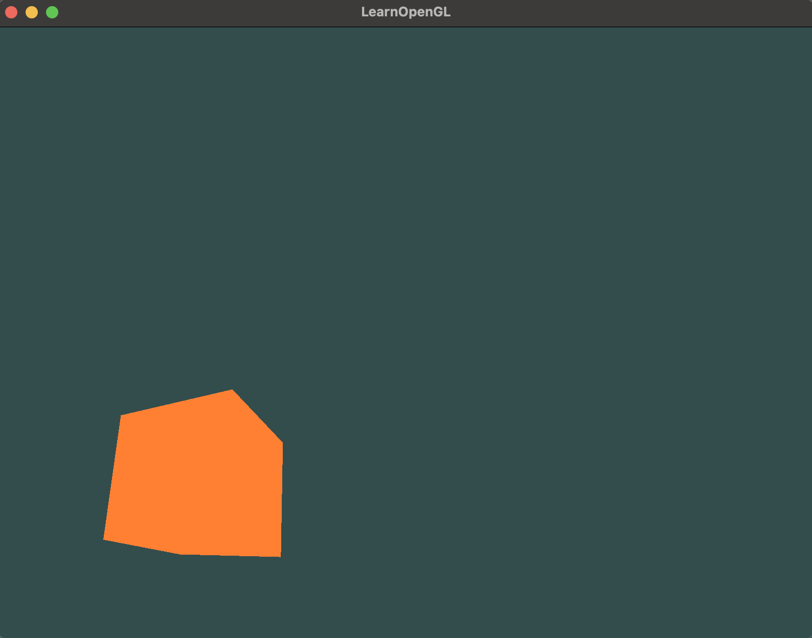

# Learning 3d Rendering

Just trying out different things here, creating small demos that can hopefully become a game someday.



* Install dependencies:

```
brew install glfw cmake glm
```


* Glad files created from https://glad.dav1d.de/

* Build
```
mkdir build
cd build
cmake ../
make
```


